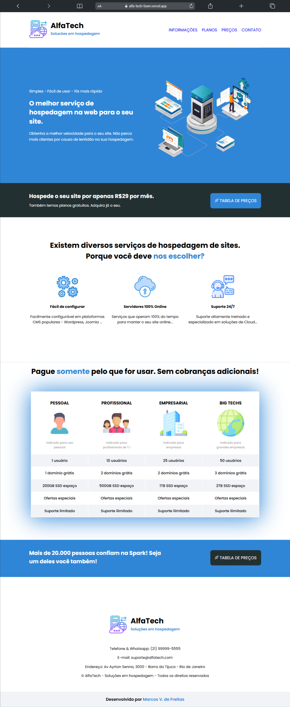

## 🖥 Projeto DevMedia

Website AlfaTech - Provedor de hospedagem

## Sobre o projeto 

A proposta desse projeto é criar um site utilizando as tecnologias HTML e CSS. Dessa forma você poderá colocar em prática os seguintes conceitos:

* Inserir navegação entre páginas;
* Utilizar tags de tabelas;

## Amostra do website 

  
